### Greetings

Welcome to my GitHub profile!

I'm a robotics researcher at the Technical University of Darmstadt, focusing on ground robot reconnaissance in rescue contexts (harsh and unknown terrain).  
The challenges include limited computational power, limited communication, harsh and unknown environments, and many more.
I am also working on UI and have released some cool libraries and plugins that help robotics enthusiasts create visually appealing UIs.  
Open-source libraries for UGV navigation are expected to follow in the coming years.

### Projects by Category

#### ⭐ Featured

<table>
<tr>
<td></td>
<td><a href="https://github.com/StefanFabian/rqml"><b>rqml</b></a></td>
<td>Modern QML-based robotics visualization and control toolbox for ROS 2.</td>
</tr>
<tr>
<td></td>
<td><a href="https://github.com/StefanFabian/ros_camera_server"><b>ros_camera_server</b></a></td>
<td>A high-performance camera streaming server for ROS, designed for robotics applications where bandwidth and latency matter.</td>
</tr>
</table>

#### 🤖 Robotics UIs & Visualization
Tools for building modern, great-looking interfaces for robotics applications.

<table>
<tr>
<td></td>
<td><a href="https://github.com/StefanFabian/qml_ros2_plugin"><b>qml_ros2_plugin</b></a></td>
<td>Connects QML and ROS 2 for great-looking robotics GUIs (Qt5).</td>
</tr>
<tr>
<td></td>
<td><a href="https://github.com/StefanFabian/qml6_ros2_plugin"><b>qml6_ros2_plugin</b></a></td>
<td>Qt6 QML plugin enabling full ROS 2 communication.</td>
</tr>
<tr>
<td></td>
<td><a href="https://github.com/StefanFabian/qml_ros_plugin"><b>qml_ros_plugin</b></a></td>
<td>The original ROS 1 / QML bridge for robotics UIs.</td>
</tr>
<tr>
<td></td>
<td><a href="https://github.com/tu-darmstadt-ros-pkg/hector_rviz_overlay"><b>hector_rviz_overlay</b></a></td>
<td>Overlay Qt and QML UIs on top of the 3D scene in RViz.</td>
</tr>
</table>

#### 🐟 ROS Message Introspection
Communicating with messages whose types are unknown at compile time.

<table>
<tr>
<td></td>
<td><a href="https://github.com/LOEWE-emergenCITY/ros_babel_fish"><b>ros2_babel_fish</b></a></td>
<td>ROS 2 message introspection for messages, actions, and services unknown at compile time.</td>
</tr>
<tr>
<td></td>
<td><a href="https://github.com/StefanFabian/ros_babel_fish"><b>ros_babel_fish</b></a></td>
<td>The original ROS 1 version: communicate using messages only known at runtime.</td>
</tr>
</table>

#### 🔌 Embedded Utilities

<table>
<tr>
<td></td>
<td><a href="https://github.com/StefanFabian/crosstalk"><b>crosstalk</b></a></td>
<td>C++17 serial data exchange library for easy structured data exchange between microcontrollers and PCs.</td>
</tr>
</table>

